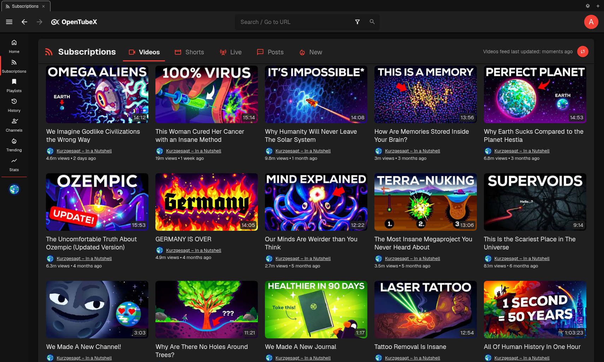
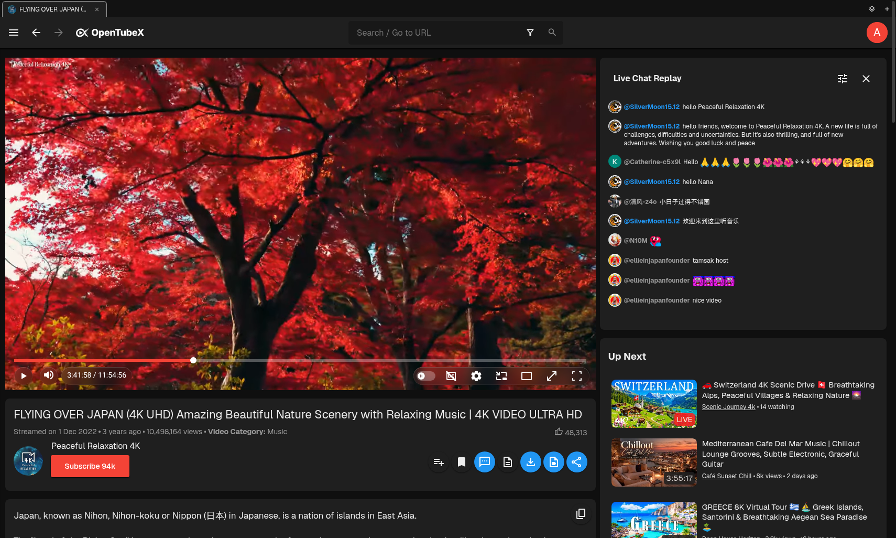
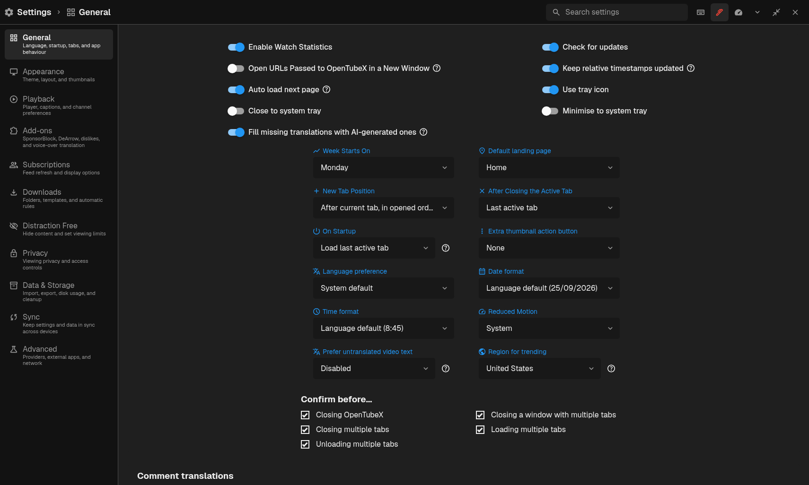

 

OpenTubeX is an open-source, highly customizable, privacy-focused YouTube client.
It is available for Windows 10 and later, macOS 12 and later, and Linux. There are also early WIP Android builds and iOS support is planned.

It originated as a fork of [FreeTube](https://github.com/FreeTubeApp/FreeTube)
and is independently developed and supported. It is not affiliated with,
endorsed by, maintained by, or supported by the FreeTube project.

 
<a href="https://opentubex.org/downloads/">⬇️ Download OpenTubeX</a>

  
  
  
  

<a href="#screenshots">Screenshots</a> &bull; <a href="#features">Features</a> &bull; <a href="#how-does-it-work">How does it work?</a> &bull; <a href="#download-links">Download Links</a> &bull; <a href="#contributing">Contributing</a> &bull; <a href="#localization">Localization</a> &bull; <a href="#contact">Contact</a> &bull; <a href="#license">License</a>

<a href="https://opentubex.org/">Website</a> &bull; <a href="PRIVACY.md">Privacy</a> &bull; <a href="https://github.com/OpenTubeX/OpenTubeX/discussions">Discussions</a>

> [!NOTE]
> OpenTubeX is currently in Beta. While it should work well for most users, there are still bugs and missing features that need to be addressed.
>
> If you have an idea or if you found a bug, please submit a [GitHub issue](https://github.com/OpenTubeX/OpenTubeX/issues/new/choose) so that we can track it.  Please [search the existing issues](https://github.com/OpenTubeX/OpenTubeX/issues?q=is%3Aissue+sort%3Arelevance-desc) before submitting to prevent duplicates!

## ✨ Why OpenTubeX?

Watch YouTube without ads or a Google account, with subscriptions, playlists and
history stored on your device by default. OpenTubeX gives you control over what
appears in your feed, how videos play and how the app looks.

- **Choose what fills your feed.** Group subscriptions into profiles, choose whether each channel shows videos, Shorts, live streams or posts, and set daily video limits. Optional recommendations rank unwatched videos locally using your viewing activity and feedback.
- **Set playback preferences once.** Save speed and quality preferences per channel, customize keyboard shortcuts, skip silence or repeat a section of a video. SponsorBlock lets you choose which segments to skip and which channels to exempt.
- **Keep watching while you browse.** Open videos in tabs, build a queue and keep the mini-player playing as you switch tabs. Restore your desktop session when you return.
- **Make the interface fit you.** Choose or create a theme, rearrange navigation and put the controls you use in Quick Settings. Customize your Home page with subscriptions, unfinished videos, playlists and more.
- **Decide where your library lives.** Keep your data local or enable sync across devices. End-to-end encryption is available with enhanced-privacy sync on a compatible server. See the [privacy guide](PRIVACY.md) for what each option shares.
- **Keep track of your viewing.** See your watch time in daily and weekly charts, search your watch history and choose how long to keep it.

## 📸 Screenshots

| The main OpenTubeX window |
| --- |
| <picture> <source media="(prefers-color-scheme: light)" srcset="docs/screenshots/OpenTubeX1-light.png"> <source media="(prefers-color-scheme: dark)" srcset="docs/screenshots/OpenTubeX1-dark.png">  </picture> |

| Watching a video |
| --- |
| <picture> <source media="(prefers-color-scheme: light)" srcset="docs/screenshots/OpenTubeX2-light.png"> <source media="(prefers-color-scheme: dark)" srcset="docs/screenshots/OpenTubeX2-dark.png">  </picture> |

| Settings |
| --- |
| <picture> <source media="(prefers-color-scheme: light)" srcset="docs/screenshots/OpenTubeX3-light.png"> <source media="(prefers-color-scheme: dark)" srcset="docs/screenshots/OpenTubeX3-dark.png">  </picture> |

## 🚀 Features

* Watch videos without ads
* Use YouTube without Google tracking you using cookies and JavaScript
* Two extractor APIs to choose from (Built in or Invidious)
* Subscribe to channels without an account
* Connect to an externally setup proxy such as Tor
* View and search your local subscriptions, playlists and history
* Organize your subscriptions into "Profiles" to create a more focused feed
* Export & import subscriptions
* YouTube Trending
* YouTube Chapters
* Most popular videos page based on the set Invidious instance
* SponsorBlock
* DeArrow
* Open videos from your browser directly into OpenTubeX (with extension)
* Watch videos using an external player
* Full Theme support
* Make a screenshot of a video
* Multiple windows
* Mini Player (Picture-in-Picture)
* Keyboard shortcuts
* Option to show only family friendly content
* Show/hide functionality or elements within the app using the distraction free settings
* View channel posts

[View more on the OpenTubeX website](https://opentubex.org/extra-features/).

## ⚙️ How does it work?
OpenTubeX uses a built-in extractor to request data and videos directly from YouTube. The [Invidious API](https://github.com/iv-org/invidious) can be used instead; depending on the video proxy setting, media requests may still go directly to YouTube. OpenTubeX does not use YouTube's official API.

OpenTubeX does not load the standard YouTube website or its page JavaScript, which reduces the browser-based tracking surface. It does not hide network requests: YouTube, an Invidious operator, or an optional service may still observe request metadata, including your IP address unless a proxy is used. See [PRIVACY.md](PRIVACY.md) for the complete threat model.

By default, subscriptions, playlists, settings, history, profiles and other app data remain on your device. When synchronization is enabled, copies of the selected data categories are sent to the configured sync server. Enhanced-privacy sync encrypts those copies on your device before upload; legacy sync servers may receive them in plaintext.

> [!IMPORTANT]  
> Using a VPN or Tor is highly recommended to hide your IP while using OpenTubeX.

## 🧩 Browser Extensions
The following extensions open YouTube links directly in OpenTubeX:

- ~~[LibRedirect](https://libredirect.manerakai.com/)~~ not yet, pending PR [#1139](https://github.com/libredirect/browser_extension/pull/1139)
- [RedirectTube](https://github.com/MStankiewiczOfficial/RedirectTube) since version 2.0.0 (26071)

LibRedirect automatically redirect YouTube links to OpenTubeX.
> [!IMPORTANT]
> To ensure proper functionality, select OpenTubeX as Frontend in the Services settings of the extension.

RedirectTube, doesn’t automatically open YouTube links in OpenTubeX (although this feature can be enabled in the settings). Instead, it adds buttons to the toolbar and context menu, which you can click to open videos in OpenTubeX manually.

- Download LibRedirect from [Mozilla Add-ons](https://addons.mozilla.org/firefox/addon/libredirect/) (for Firefox based-browsers) or [developer's website](https://libredirect.manerakai.com/download_chromium.html) (for Chrome and Chromium-based browsers).

- Download RedirectTube from [Mozilla Add-ons](https://addons.mozilla.org/firefox/addon/redirecttube/) (for Firefox based-browsers) or [Chrome Web Store](https://chromewebstore.google.com/detail/redirecttube/jpbaggklodpddjcadlebabhiopjkjfjh) (for Chrome and Chromium-based browsers).

> [!NOTE]
> These extensions do not work on Linux portable builds!
>
> If you have issues with the extension working with OpenTubeX, please create an issue in this repository instead of the extension repository.

## 📦 Download Links
### Official Downloads

> [!CAUTION]
> Stable OpenTubeX releases currently support Windows 10 and later, macOS 12 and above, and various Linux distributions. Mobile builds are an early preview and may have incomplete features.

* [GitHub Releases](https://github.com/OpenTubeX/OpenTubeX/releases)
* [OpenTubeX Website](https://opentubex.org/downloads/)
* Windows: [WinGet](https://github.com/microsoft/winget-pkgs/tree/master/manifests/o/OpenTubeX/OpenTubeX) (`winget install OpenTubeX.OpenTubeX`)
* macOS: [Homebrew tap](https://github.com/OpenTubeX/homebrew-tap) (`brew install --cask opentubex/tap/opentubex`), with [installation and update instructions](https://opentubex.org/downloads/#install-homebrew).
* Debian / Ubuntu: [APT repository](https://apt.opentubex.org/)
* Fedora / Enterprise Linux: [COPR repository](https://copr.fedorainfracloud.org/coprs/d3sox/opentubex/) or [RPM repository](https://rpm.opentubex.org/)
* openSUSE: [RPM repository](https://rpm.opentubex.org/)
* Flatpak: [OpenTubeX remote](https://flatpak.opentubex.org/), [Flatpark](https://flatpark.org/apps/org.opentubex.OpenTubeX/), and [source code](https://github.com/OpenTubeX/flatpak)
* Snap: [Snap Store](https://snapcraft.io/opentubex) (`sudo snap install opentubex --beta`), [installation instructions](https://snap.opentubex.org/), and [source code](https://github.com/OpenTubeX/snap)
* Nix / NixOS / macOS: [Official Nix flake](https://github.com/OpenTubeX/nix) (`nix profile install github:OpenTubeX/nix`, with flakes enabled), supporting x86_64 and ARM64. See the [installation instructions](https://opentubex.org/downloads/#install-nix).
* Arch User Repository (AUR): [Download](https://aur.archlinux.org/packages/opentubex-bin/)
* Android preview: requires Android 8.0 or newer (API 26). Current APKs compile and target Android 16 (API 36). Install and update through the [OpenTubeX F-Droid repository](https://fdroid.opentubex.org/) or [Obtainium](https://apps.obtainium.imranr.dev/redirect?r=obtainium://add/https://github.com/OpenTubeX/OpenTubeX).

To update a Homebrew installation, run `brew update` followed by `brew upgrade --cask opentubex`. Both Apple Silicon and Intel Macs are supported. If macOS blocks the first launch, allow OpenTubeX in **System Settings → Privacy & Security**.

iOS support is planned. The first iOS builds will be downloadable `.ipa` files.

 

#### Automated Builds (Nightly / Daily)
> [!WARNING]
> Use these builds at your own risk. These are pre-release versions and are only intended for people that want to test changes early and are willing to accept that things could break from one build to another. 

Builds are automatically created from changes to our development branch via [GitHub Actions](http://github.com/OpenTubeX/OpenTubeX/actions/workflows/build.yml).

The first build with a green check mark is the latest build.

> [!IMPORTANT]
> You will need to have a GitHub account to download these builds.
> If you don't have a GitHub account, you can download the builds via [nightly.link](https://nightly.link/OpenTubeX/OpenTubeX/workflows/build/development).

* Debian / Ubuntu: [APT nightly repository](https://apt.opentubex.org/#nightly-builds)
* Fedora / Enterprise Linux: [RPM nightly repository](https://rpm.opentubex.org/#nightly-builds)
* openSUSE: [RPM nightly repository](https://rpm.opentubex.org/#nightly-builds)
* Flatpak: [Nightly branch](https://flatpak.opentubex.org/#nightly-builds) (`org.opentubex.OpenTubeX//nightly`)
* Snap: [Edge channel](https://snap.opentubex.org/#development-builds) (`sudo snap install opentubex --edge`)
* Arch User Repository (AUR): [Download](https://aur.archlinux.org/packages/opentubex-git/) (`opentubex-git`)
* Android: [OpenTubeX Nightly on F-Droid](https://fdroid.opentubex.org/#release-channels), [OpenTubeX Nightly through Obtainium](https://apps.obtainium.imranr.dev/redirect?r=obtainium://app/%7B%22id%22%3A%22org.opentubex.app.nightly%22%2C%22url%22%3A%22https%3A%2F%2Fgithub.com%2FOpenTubeX%2FOpenTubeX%22%2C%22author%22%3A%22OpenTubeX%22%2C%22name%22%3A%22OpenTubeX%20Nightly%22%2C%22preferredApkIndex%22%3A0%2C%22additionalSettings%22%3A%22%7B%5C%22includePrereleases%5C%22%3Atrue%2C%5C%22fallbackToOlderReleases%5C%22%3Atrue%2C%5C%22filterReleaseTitlesByRegEx%5C%22%3A%5C%22nightly%5C%22%2C%5C%22apkFilterRegEx%5C%22%3A%5C%22android-%28arm64-v8a%7Carmeabi-v7a%7Cx86_64%7Cx86%7Cuniversal%29%5B.%5Dapk%24%5C%22%2C%5C%22autoApkFilterByArch%5C%22%3Atrue%7D%22%2C%22overrideSource%22%3A%22GitHub%22%7D), or an APK for your device’s architecture from the build artifacts

## 🤝 Contributing
Thank you very much to the people and projects that make OpenTubeX possible!

If you like to get your hands dirty and want to contribute, we would love to
have your help.  Send a pull request and someone will review your code. 

> [!IMPORTANT]
> Please follow the [Contribution Guidelines](https://github.com/OpenTubeX/OpenTubeX/blob/development/CONTRIBUTING.md) before sending your pull request.

## 🌍 Localization

We are actively looking for translations! We use [Weblate](https://weblate.opentubex.org/engage/opentubex/) to make it easy for translators to get involved. Click on one of the graphics above to learn how to get involved.

For the Linux Flatpak, the desktop entry comment string can be translated at our [Flatpak repository](https://github.com/OpenTubeX/flatpak/blob/main/org.opentubex.OpenTubeX.desktop).

## 💬 Contact
If you ever have any questions, feel free to ask on our [Discussions](https://github.com/OpenTubeX/OpenTubeX/discussions) page, join our [Fluxer](https://fluxer.opentubex.org) server, or our [Matrix](https://matrix.opentubex.org) space (`#opentubex:matrix.org`).

## 🤖 AI-assisted development

OpenTubeX is developed extensively with AI-assisted tools. This allows our small
maintainer team to develop features, fix bugs, and iterate much more rapidly.
The source code remains open for anyone to inspect, review, modify, or fork.

This disclosure refers to how OpenTubeX is developed. It does not mean the app
sends your viewing data to an AI service. If AI-assisted development does not
align with your preferences, OpenTubeX may simply not be the right project for
you.

## 📄 License
  

OpenTubeX is Free Software: You can use, study share and improve it at your
will. Specifically you can redistribute and/or modify it under the terms of the
[GNU Affero General Public License](https://www.gnu.org/licenses/agpl-3.0.html) as
published by the Free Software Foundation, either version 3 of the License, or
(at your option) any later version.  
