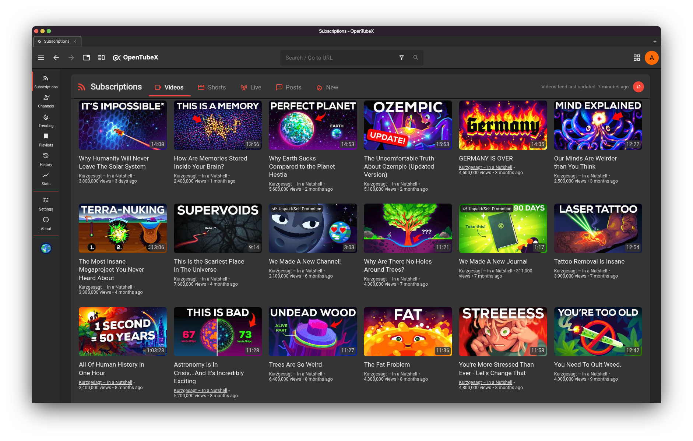
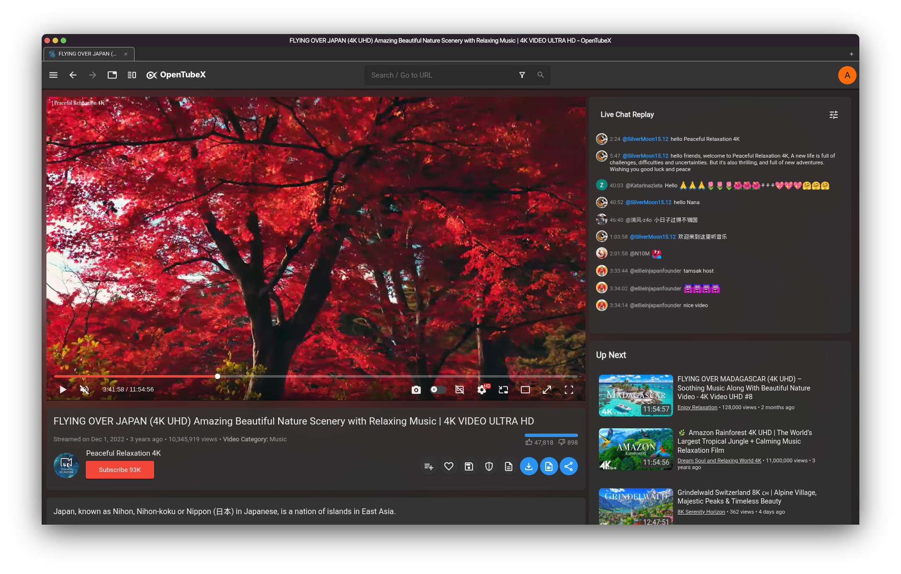
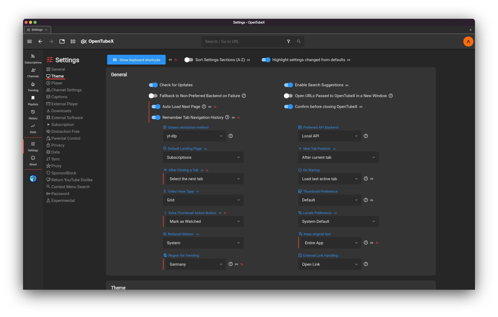

 

OpenTubeX is an open-source, highly customizable, privacy-focused desktop YouTube client.
It is available for Windows 10 and later, macOS 12 and later, and Linux.

It originated as a fork of [FreeTube](https://github.com/FreeTubeApp/FreeTube)
and is independently developed and supported. It is not affiliated with,
endorsed by, maintained by, or supported by the FreeTube project.

 
<a href="https://opentubex.org/downloads/">⬇️ Download OpenTubeX</a>

  
  
  
  

<a href="#features-added-by-opentubex">Added features</a> &bull; <a href="#screenshots">Screenshots</a> &bull; <a href="#how-does-it-work">How does it work?</a> &bull; <a href="#features">Features</a> &bull; <a href="#download-links">Download Links</a> &bull; <a href="#contributing">Contributing</a> &bull; <a href="#localization">Localization</a> &bull; <a href="#contact">Contact</a> &bull; <a href="#license">License</a>

<a href="https://opentubex.org/">Website</a> &bull; <a href="PRIVACY.md">Privacy</a> &bull; <a href="https://github.com/OpenTubeX/OpenTubeX/discussions">Discussions</a>

## ✨ Why OpenTubeX?

OpenTubeX is aimed at users who want extensive control over their viewing
experience. Some of its major areas of focus are:

- **More playback control**, including per-channel speed and quality preferences, customizable shortcuts, a quick speed bar and silence skipping.
- **A browser-style desktop workflow** with tabs, configurable session restoration, multiple windows, a scroll mini-player and a watch queue.
- **Deeper SponsorBlock integration** with a segment side panel, richer skip controls, channel whitelisting, submissions and full-video labels.
- **More ways to manage and understand your library** through watch-time statistics, configurable history retention, enhanced subscription refreshes and advanced search history.
- **Optional end-to-end encrypted sync** for subscriptions, playlists, history, profiles, tabs and settings, including saved channel settings.

> [!NOTE] 
> OpenTubeX is currently in Beta. While it should work well for most users, there are still bugs and missing features that need to be addressed.
>
> If you have an idea or if you found a bug, please submit a [GitHub issue](https://github.com/OpenTubeX/OpenTubeX/issues/new/choose) so that we can track it.  Please [search the existing issues](https://github.com/OpenTubeX/OpenTubeX/issues?q=is%3Aissue+sort%3Arelevance-desc) before submitting to prevent duplicates!

## 🚀 Features added by OpenTubeX

[View the feature overview on the OpenTubeX website](https://opentubex.org/extra-features/), or expand the list below.

Show feature list

- Manage and automatically apply playback speed, video quality, subtitles and volume for individual channels. You can enable each option in settings. Playback speeds can be saved automatically whenever you change them through the player options, or you can leave automatic saving off and use the dedicated button below the player to save the current speed for that channel manually.
 
  
 
  
 

- Option if you want to multiply seek intervals by playback rate. By default, seek intervals (arrow keys and J/L) are not multiplied by playback rate. You can change this in Player Settings if you prefer the previous behavior.
 

- Option for playback rate adjusted timestamps

 

- Improved chapter tooltips on the seekbar and chapter display in the sidebar

 

- Option to prevent title/description translations by YouTube

- Focus search bar when pressing <kbd>/</kbd> key in addition to <kbd>Ctrl</kbd> / <kbd>Cmd</kbd> + <kbd>L</kbd>

- In-page search with <kbd>Ctrl</kbd> / <kbd>Cmd</kbd> + <kbd>F</kbd>, including previous and next match navigation

- SponsorBlock side panel with segment details, a temporary auto-skip toggle and channel whitelisting

- Improved SponsorBlock tooltips with unskip/reskip/prompt to skip feature

- Supports SponsorBlock community contributed chapters, Highlight and Hook/Greetings category
- SponsorBlock category labels when hovering over segments on the seekbar

- Experimental SponsorBlock submission

- Tabs like in a web browser, including horizontal and vertical layouts, pinning, colors, thumbnail previews, duplication, unloading, multi-selection, reordering, moving tabs between windows, bulk actions, copying YouTube links and configurable session restoration

 

- Option to define a script to run when YouTube blocked your IP. It will automatically run it and reload the video after it has finished

- Auto Picture-in-Picture when switching tabs, minimizing or switching windows, plus a scroll mini-player option

 

- Loop & Copy link in player context menu

- Optional, fully customizable Quick Playback Speed Bar in the player

- Return YouTube Dislike Support

- Remember Volume feature (on by default)

- Player shortcut <kbd>G</kbd> to toggle between 1x and the last playback speed

- Persistent subscription auto-refresh timers, a visual refresh indicator and feed items that stay visible while refreshing

- Watch time statistics with daily and weekly charts

- Configurable extra thumbnail action button

- Additional video metadata, including AI-generated content and paid-promotion labels, collaborators, categories, games, tags, relative publication dates and comment counts

 

 

 

- Reorder or remove playlist items during playback and remember the reverse state of each playlist

- Nested comment reply threads, edited-comment indicators, comment reloading and direct YouTube links to comments

 

 

- Import subscriptions and watch history from [LibreTube](https://github.com/libre-tube/LibreTube)

- Optional confirmation before closing the app

- Transcript panel

- Skip silence (needs to be enabled via Player settings)

- Support for YouTube end-screen annotations

- Ambient Mode for the player

- Configurable thumbnail sizes

- Sleep timer

 

- Automatic history retention cleanup and manual deletion of old entries

 

- Hold the left mouse button or <kbd>Space</kbd> to temporarily double the playback speed

 

- Caption appearance controls and a preferred caption language setting

- Reliable video playback and advanced video, audio and playlist downloads with yt-dlp, stand-alone SRT, VTT, ASS and LRC subtitle downloads, and a page for managing active and completed downloads

- Resizable and rearrangeable full-screen docks for video info, comments, playlists, chapters and live chat

- Customizable keyboard shortcuts

- Experimental support for rewinding live streams and premieres

- Indicators for newly fetched subscription content and an optional separate new-content feed

 

- Autoplay preview with the next video and countdown displayed on the player

- UI animations with an option to force-enable or disable them independently of system settings

- Premiere indicators in video lists and metadata

- Resizable playlist card while watching a video

- Open a chatter's channel by clicking their handle in live chat

- Support for end-to-end encrypted synchronization of subscriptions, playlists, history, profiles, tabs and settings, including saved channel settings. LibreTube Sync Servers are also supported.

- Simple watch queue. Videos can be queued from the three-dots menu and managed in a side panel on the watch page, including drag-and-drop reordering.

- Add-to-playlist inline popover that lets you select which playlists a video should be added to, plus custom icon, emoji and cropped-image options for the quick-bookmark playlist.

 

 

- Search selected text using your chosen search engine.

- Full search history with restored filters when selecting a search suggestion, plus chips to filter channel search results.

- Customizable watched-percentage threshold. Set it to 0% to restore the old behavior of marking videos as watched instantly.

- Option to highlight settings that differ from their defaults, with a reset button for them.

- Toast notifications with icons, optional timeout indicators and video thumbnails. Their position is customizable and they can be dismissed by swiping them away or pressing <kbd>Escape</kbd>.

- Option to adjust how rounded UI elements should be, with consistently applied rounding and overlay scrollbars that can remain visible instead of automatically hiding.

- Option to use a YouTube-style Shorts display and player or the regular video grid and player.

- Display and submission support for SponsorBlock full-video labels and mute segments.

- Subscription feed refreshes can be canceled and show new videos instantly while loading the rest.

- Draggable, resizable settings window with integrated subpages and cross-category search

- Improved live streams and premieres with automatic premiere refreshes, comments, chat replay, optional chat timestamps and a choice between top chat and all messages

- Quick-settings menu for profiles and common preferences, with customizable emoji or cropped-image profile icons

- Synchronized voice-over translation for supported videos via the unofficial Yandex API, with separate translated and original volume controls

https://github.com/user-attachments/assets/0df65773-8f13-4c5e-90d6-2db9106dea98

- Zoom and pan videos from the player menu. Press <kbd>Z</kbd> to zoom in, <kbd>Shift</kbd> + <kbd>Z</kbd> to zoom out, or hold <kbd>Shift</kbd> and drag to pan.

- Operating-system notifications when scheduled live streams and premieres start

- Create, import, export and edit custom themes, with independent light and dark themes when following the system setting

- Automatically translate captions into any language offered by YouTube

- Choose between Material Symbols and Remix Icon throughout the interface

## 📸 Screenshots
| The main OpenTubeX window                                                                         |
|--------------------------------------------------------------------------------------------------|
|                                                             |

| Watching a video                                                                                 |
|--------------------------------------------------------------------------------------------------|
|                                                             |

| Settings                                                                                         |
|--------------------------------------------------------------------------------------------------|
|                                                             |

## ⚙️ How does it work?
OpenTubeX uses a built-in extractor to request data and videos directly from YouTube. The [Invidious API](https://github.com/iv-org/invidious) can be used instead; depending on the video proxy setting, media requests may still go directly to YouTube. OpenTubeX does not use YouTube's official API.

OpenTubeX does not load the standard YouTube website or its page JavaScript, which reduces the browser-based tracking surface. It does not hide network requests: YouTube, an Invidious operator, or an optional service may still observe request metadata, including your IP address unless a proxy is used. See [PRIVACY.md](PRIVACY.md) for the complete threat model.

By default, subscriptions, playlists, settings, history, profiles and other app data remain on your device. When synchronization is enabled, copies of the selected data categories are sent to the configured sync server. Enhanced-privacy sync encrypts those copies on your device before upload; legacy sync servers may receive them in plaintext.

> [!IMPORTANT]  
> Using a VPN or Tor is highly recommended to hide your IP while using OpenTubeX.

## 🎯 Features
* Watch videos without ads
* Use YouTube without Google tracking you using cookies and JavaScript
* Two extractor APIs to choose from (Built in or Invidious)
* Subscribe to channels without an account
* Connect to an externally setup proxy such as Tor
* View and search your local subscriptions, playlists and history
* Organize your subscriptions into "Profiles" to create a more focused feed
* Export & import subscriptions
* YouTube Trending
* YouTube Chapters
* Most popular videos page based on the set Invidious instance
* SponsorBlock
* DeArrow
* Open videos from your browser directly into OpenTubeX (with extension)
* Watch videos using an external player
* Full Theme support
* Make a screenshot of a video
* Multiple windows
* Mini Player (Picture-in-Picture)
* Keyboard shortcuts
* Option to show only family friendly content
* Show/hide functionality or elements within the app using the distraction free settings
* View channel posts

### Browser Extensions
The following extensions open YouTube links directly in OpenTubeX:

- ~~[LibRedirect](https://libredirect.manerakai.com/)~~ not yet, pending PR [#1139](https://github.com/libredirect/browser_extension/pull/1139)
- [RedirectTube](https://github.com/MStankiewiczOfficial/RedirectTube) since version 2.0.0 (26071)

LibRedirect automatically redirect YouTube links to OpenTubeX.
> [!IMPORTANT]
> To ensure proper functionality, select OpenTubeX as Frontend in the Services settings of the extension.

RedirectTube, doesn’t automatically open YouTube links in OpenTubeX (although this feature can be enabled in the settings). Instead, it adds buttons to the toolbar and context menu, which you can click to open videos in OpenTubeX manually.

- Download LibRedirect from [Mozilla Add-ons](https://addons.mozilla.org/firefox/addon/libredirect/) (for Firefox based-browsers) or [developer's website](https://libredirect.manerakai.com/download_chromium.html) (for Chrome and Chromium-based browsers).

- Download RedirectTube from [Mozilla Add-ons](https://addons.mozilla.org/firefox/addon/redirecttube/) (for Firefox based-browsers) or [Chrome Web Store](https://chromewebstore.google.com/detail/redirecttube/jpbaggklodpddjcadlebabhiopjkjfjh) (for Chrome and Chromium-based browsers).

> [!NOTE]
> These extensions do not work on Linux portable builds!
>
> If you have issues with the extension working with OpenTubeX, please create an issue in this repository instead of the extension repository.

## 📦 Download Links
### Official Downloads

> [!CAUTION]
> OpenTubeX is only supported on Windows 10 and later, macOS 12 and above, and various Linux distributions. Installing it on unsupported systems may result in unexpected issues.

* [GitHub Releases](https://github.com/OpenTubeX/OpenTubeX/releases)
* [OpenTubeX Website](https://opentubex.org/downloads/)
* Windows: [WinGet](https://github.com/microsoft/winget-pkgs/tree/master/manifests/o/OpenTubeX/OpenTubeX) (`winget install OpenTubeX.OpenTubeX`)
* Debian / Ubuntu: [APT repository](https://apt.opentubex.org/)
* Fedora / Enterprise Linux: [COPR repository](https://copr.fedorainfracloud.org/coprs/d3sox/opentubex/) or [RPM repository](https://rpm.opentubex.org/)
* openSUSE: [RPM repository](https://rpm.opentubex.org/)
* Flatpak: [OpenTubeX remote](https://flatpak.opentubex.org/), [Flatpark](https://flatpark.org/apps/org.opentubex.OpenTubeX/), and [source code](https://github.com/OpenTubeX/flatpak)
* Arch User Repository (AUR): [Download](https://aur.archlinux.org/packages/opentubex-bin/)

 

#### Automated Builds (Nightly / Daily)
> [!WARNING]
> Use these builds at your own risk. These are pre-release versions and are only intended for people that want to test changes early and are willing to accept that things could break from one build to another. 

Builds are automatically created from changes to our development branch via [GitHub Actions](http://github.com/OpenTubeX/OpenTubeX/actions/workflows/build.yml).

The first build with a green check mark is the latest build.

> [!IMPORTANT]
> You will need to have a GitHub account to download these builds.
> If you don't have a GitHub account, you can download the builds via [nightly.link](https://nightly.link/OpenTubeX/OpenTubeX/workflows/build/development).

* Debian / Ubuntu: [APT nightly repository](https://apt.opentubex.org/#nightly-builds)
* Fedora / Enterprise Linux: [RPM nightly repository](https://rpm.opentubex.org/#nightly-builds)
* openSUSE: [RPM nightly repository](https://rpm.opentubex.org/#nightly-builds)
* Flatpak: [Nightly branch](https://flatpak.opentubex.org/#nightly-builds) (`org.opentubex.OpenTubeX//nightly`)
* Arch User Repository (AUR): [Download](https://aur.archlinux.org/packages/opentubex-git/) (`opentubex-git`)

## 🤝 Contributing
Thank you very much to the people and projects that make OpenTubeX possible!

If you like to get your hands dirty and want to contribute, we would love to
have your help.  Send a pull request and someone will review your code. 

> [!IMPORTANT]
> Please follow the [Contribution Guidelines](https://github.com/OpenTubeX/OpenTubeX/blob/development/CONTRIBUTING.md) before sending your pull request.

## 🌍 Localization

We are actively looking for translations! We use [Weblate](https://weblate.d3sox.me/engage/opentubex/) to make it easy for translators to get involved. Click on one of the graphics above to learn how to get involved.

For the Linux Flatpak, the desktop entry comment string can be translated at our [Flatpak repository](https://github.com/OpenTubeX/flatpak/blob/main/org.opentubex.OpenTubeX.desktop).

## 💬 Contact
If you ever have any questions, feel free to ask on our [Discussions](https://github.com/OpenTubeX/OpenTubeX/discussions) page, join our [Fluxer](https://fluxer.opentubex.org) server, or our [Matrix](https://matrix.opentubex.org) space (`#opentubex:matrix.org`).

## 🤖 AI-assisted development

OpenTubeX is developed extensively with AI-assisted tools. This allows our small
maintainer team to develop features, fix bugs, and iterate much more rapidly.
The source code remains open for anyone to inspect, review, modify, or fork.

This disclosure refers to how OpenTubeX is developed. It does not mean the app
sends your viewing data to an AI service. If AI-assisted development does not
align with your preferences, OpenTubeX may simply not be the right project for
you.

## 📄 License
  

OpenTubeX is Free Software: You can use, study share and improve it at your
will. Specifically you can redistribute and/or modify it under the terms of the
[GNU Affero General Public License](https://www.gnu.org/licenses/agpl-3.0.html) as
published by the Free Software Foundation, either version 3 of the License, or
(at your option) any later version.  
